# Data Flow Diagrams for Book Binding
## Three Separate Systems - Portrait Format

This document contains **three separate DFDs** designed for book binding. Each diagram is portrait-oriented and fits on one page, showing one system's complete flow with references to other systems.

---

## Page 1: Customer Mobile App System

Customer-facing mobile application flow from login to payment completion.

```mermaid
flowchart TD
    Start([👤 CUSTOMER MOBILE APP<br/>START])

    Start --> CheckToken{Has Valid<br/>JWT Token?}
    CheckToken -->|No| Login[Login Screen]
    Login --> EnterCreds[Enter Email/Password]
    EnterCreds --> AuthAPI[POST /api/auth/login]

    AuthAPI --> ValidCreds{Valid<br/>Credentials?}
    ValidCreds -->|No| LoginFail[❌ Login Failed]
    LoginFail --> Login

    ValidCreds -->|Yes| GenToken[Generate JWT Token]
    GenToken --> StoreToken[Store in SecureStorage]
    StoreToken --> Dashboard[📱 Customer Dashboard]

    CheckToken -->|Yes| Dashboard

    Dashboard --> Actions{Select<br/>Action}

    Actions -->|Create Request| CheckActive[Check Active Request]
    CheckActive --> HasActive{Has Active<br/>Request?}
    HasActive -->|Yes| ErrorDupe[❌ Already Have Active Request]
    HasActive -->|No| RequestForm[Fill Request Form]
    RequestForm --> SubmitReq[Submit Request]

    SubmitReq --> CreateDB[(Create Request in Database)]
    CreateDB --> ToQueue[Request Sent to Queue]
    ToQueue --> AdminSys{{Admin Web System<br/>Approves/Declines}}

    AdminSys --> WaitApproval[Wait for Approval]
    WaitApproval --> Approved{Request<br/>Approved?}
    Approved -->|No| NotifyDeclined[📧 Request Declined]
    NotifyDeclined --> Dashboard

    Approved -->|Yes| RobotSys1{{Robot System<br/>Navigates to Customer}}
    RobotSys1 --> NotifyArrived[📧 Robot Arrived]
    NotifyArrived --> ViewArrival[View Robot Status]

    Actions -->|View Status| ViewArrival
    ViewArrival --> SeeRobot[Robot Waiting at Room]

    SeeRobot --> LoadLaundry[Load Laundry into Basket]
    LoadLaundry --> WeightCheck[⚖️ Weight Sensor Validates]
    WeightCheck --> ValidWeight{Weight<br/>0.5-50kg?}
    ValidWeight -->|No| WeightError[❌ Invalid Weight]
    WeightError --> LoadLaundry

    ValidWeight -->|Yes| ConfirmLoad[Confirm Loaded]
    ConfirmLoad --> RecordWeight[POST /api/requests/confirm-loaded]
    RecordWeight --> CalcCost[Calculate Cost:<br/>Weight × ₱50/kg]
    CalcCost --> UpdateDB1[(Update Request:<br/>Status = LaundryLoaded)]

    UpdateDB1 --> RobotSys2{{Robot System<br/>Returns to Base}}
    RobotSys2 --> NotifyWashing[📧 Washing in Progress]
    NotifyWashing --> WaitWashing[Wait for Washing]

    WaitWashing --> AdminSys2{{Admin Web System<br/>Marks Washing Done}}
    AdminSys2 --> RobotSys3{{Robot System<br/>Delivers Clean Laundry}}

    RobotSys3 --> NotifyDelivery[📧 Robot Arrived with Clean Laundry]
    NotifyDelivery --> ViewDelivery[View Delivery Status]
    ViewDelivery --> UnloadLaundry[Unload Clean Laundry]

    UnloadLaundry --> UnloadWeight[⚖️ Weight Sensor Validates]
    UnloadWeight --> ValidUnload{Weight <<br/>0.5kg?}
    ValidUnload -->|No| WaitUnload[Wait for Unload]
    WaitUnload --> UnloadLaundry

    ValidUnload -->|Yes| ConfirmUnload[Confirm Unloaded]
    ConfirmUnload --> RecordUnload[POST /api/requests/confirm-unloaded]
    RecordUnload --> UpdateDB2[(Update Request:<br/>Status = Completed)]

    UpdateDB2 --> RobotSys4{{Robot System<br/>Returns to Base}}
    RobotSys4 --> NotifyComplete[📧 Service Completed]
    NotifyComplete --> CreatePayment[(Create Payment Record)]

    CreatePayment --> SeePayment[View Payment Due]
    SeePayment --> Dashboard

    Actions -->|View Receipt| FetchReceipt[GET /api/requests/receipt]
    FetchReceipt --> ShowReceipt[Display Receipt:<br/>RCP-YYYY-NNNNNN<br/>Weight, Cost, Date]
    ShowReceipt --> Dashboard

    Actions -->|Send Message| OpenMsg[Open Messages]
    OpenMsg --> TypeMsg[Type Message<br/>Optional: Image]
    TypeMsg --> SendMsg[POST /api/messages/send]
    SendMsg --> SaveMsg[(Save to Messages Table)]
    SaveMsg --> AdminSys3{{Admin Web System<br/>Receives & Responds}}
    AdminSys3 --> MsgNotify[📧 Admin Replied]
    MsgNotify --> Dashboard

    SeePayment --> AdminSys4{{Admin Web System<br/>Processes Payment}}
    AdminSys4 --> PaymentComplete[Payment Marked Paid]
    PaymentComplete --> Dashboard

    classDef customer fill:#A8D5BA,stroke:#5A9279,stroke-width:3px,color:#2C4A3A
    classDef external fill:#F4D19B,stroke:#D4A574,stroke-width:2px,color:#6B4E2A
    classDef database fill:#B8A4C9,stroke:#9181A8,stroke-width:2px,color:#4A3E5A
    classDef robot fill:#6B9AC4,stroke:#3D5A80,stroke-width:2px,color:#1E3A5F

    class Start,Dashboard,Actions,ViewArrival,LoadLaundry,UnloadLaundry,SeePayment customer
    class AdminSys,AdminSys2,AdminSys3,AdminSys4 external
    class RobotSys1,RobotSys2,RobotSys3,RobotSys4 robot
    class CreateDB,UpdateDB1,UpdateDB2,CreatePayment,SaveMsg database
```



### Customer System Summary

**Entry Point:** Customer opens mobile app

**Main Functions:**
- JWT authentication
- Request creation
- Real-time status tracking
- Laundry loading confirmation (weight-based)
- Laundry unloading confirmation
- Payment receipt viewing
- Admin messaging

**External System Interactions:**
- **Admin Web System:** Request approval, washing done, payment processing, message responses
- **Robot System:** Navigation to customer, return to base, delivery, completion
- **Database:** All request and payment data

---

## Page 2: Admin Web Dashboard System

Administrator web dashboard for managing all system operations.

```mermaid
flowchart TD
    Start([⚙️ ADMIN WEB DASHBOARD<br/>START])

    Start --> Login[Admin Login]
    Login --> ValidAdmin{Valid Admin<br/>Credentials?}
    ValidAdmin -->|No| LoginFail[❌ Access Denied]
    LoginFail --> Start

    ValidAdmin -->|Yes| CheckRole{Role =<br/>Administrator?}
    CheckRole -->|No| LoginFail
    CheckRole -->|Yes| Dashboard[🖥️ Admin Dashboard]

    Dashboard --> Menu{Select<br/>Module}

    %% Request Management
    Menu -->|Requests| ReqMgmt[Request Management]
    ReqMgmt --> LoadReq[Load All Requests<br/>Filter by Status]
    LoadReq --> ShowReq[Display:<br/>Pending/Active/Completed]

    ShowReq --> ReqAction{Select<br/>Action}
    ReqAction -->|Accept| AcceptReq[Accept Pending Request]
    AcceptReq --> UpdateAccept[(UPDATE Request:<br/>Status = Accepted)]
    UpdateAccept --> AssignRobot[Assign Available Robot]
    AssignRobot --> RobotSys1{{Robot System<br/>Receives Nav Target}}
    RobotSys1 --> CustomerSys1{{Customer System<br/>Notified}}

    ReqAction -->|Decline| DeclineReq[Enter Decline Reason]
    DeclineReq --> UpdateDecline[(UPDATE Request:<br/>Status = Declined)]
    UpdateDecline --> CustomerSys2{{Customer System<br/>Notified Declined}}

    ReqAction -->|Mark Washing Done| MarkDone[Mark Washing Complete]
    MarkDone --> UpdateDone[(UPDATE Request:<br/>Status = FinishedWashing)]
    UpdateDone --> CustomerSys3{{Customer System<br/>Notified Ready}}

    ReqAction -->|Start Delivery| StartDelivery[Assign Robot for Delivery]
    StartDelivery --> CheckRobot{Robot<br/>Available?}
    CheckRobot -->|No| ErrorNoRobot[❌ No Robots Online]
    CheckRobot -->|Yes| AssignDelivery[(UPDATE Request:<br/>Delivery Started)]
    AssignDelivery --> RobotSys2{{Robot System<br/>Delivers to Customer}}
    RobotSys2 --> CustomerSys4{{Customer System<br/>Delivery Notification}}

    ReqAction -->|Cancel| CancelReq[Cancel Request]
    CancelReq --> UpdateCancel[(UPDATE Request:<br/>Status = Cancelled)]
    UpdateCancel --> RobotSys3{{Robot System<br/>Return to Base}}

    %% User Management
    Menu -->|Users| UserMgmt[User Management]
    UserMgmt --> UserActions{User<br/>Action}
    UserActions -->|Create| CreateUser[Create New User]
    UserActions -->|Edit| EditUser[Edit User Details]
    UserActions -->|Delete| DeleteUser[Delete User]
    UserActions -->|Assign Beacon| AssignBeacon[Assign Room Beacon]

    CreateUser --> InsertUser[(INSERT INTO Users)]
    EditUser --> UpdateUser[(UPDATE Users)]
    DeleteUser --> RemoveUser[(DELETE FROM Users)]
    AssignBeacon --> UpdateBeaconUser[(UPDATE User Beacon)]

    InsertUser --> LogUser[(SystemLogs)]
    UpdateUser --> LogUser
    RemoveUser --> LogUser
    UpdateBeaconUser --> LogUser

    %% Robot Management
    Menu -->|Robots| RobotMgmt[Robot Monitoring]
    RobotMgmt --> ShowRobots[Display All Robots:<br/>Status/Task/Battery/LastPing]
    ShowRobots --> RobotAction{Robot<br/>Action}

    RobotAction -->|Emergency Stop| EmergencyStop[Send Emergency Stop]
    EmergencyStop --> SetEmergency[(UPDATE Robot:<br/>EmergencyStop = true)]
    SetEmergency --> RobotSys4{{Robot System<br/>Halts All Operations}}

    RobotAction -->|Maintenance| Maintenance[Enable Maintenance Mode]
    Maintenance --> SetMaintenance[(UPDATE Robot:<br/>MaintenanceMode = true)]
    SetMaintenance --> RobotSys5{{Robot System<br/>Stops Tasks}}

    RobotAction -->|View Camera| ViewCamera[Live Camera Feed]
    ViewCamera --> StreamCamera[GET /api/robot/camera<br/>Stream Video]

    %% Accounting
    Menu -->|Accounting| Accounting[Accounting Dashboard]
    Accounting --> ShowMetrics[Show Metrics:<br/>Revenue/Pending/Completed]
    ShowMetrics --> PayAction{Payment<br/>Action}

    PayAction -->|Mark Paid| MarkPaid[Select Payment Method:<br/>Cash or GCash]
    MarkPaid --> UpdatePaid[(UPDATE Payment:<br/>Status = Completed)]
    UpdatePaid --> CreateAdj[(INSERT PaymentAdjustment:<br/>CompletePayment)]
    CreateAdj --> CalcRevenue[Calculate Total Revenue]
    CalcRevenue --> UpdateDash[Update Dashboard Metrics]

    PayAction -->|Refund| IssueRefund[Process Refund]
    IssueRefund --> UpdateRefund[(UPDATE Payment:<br/>Status = Refunded)]
    UpdateRefund --> CalcRevenue

    PayAction -->|Generate Report| GenReport[Select Period:<br/>Today/Week/Month/Custom]
    GenReport --> QueryReport[(Query Payments<br/>JOIN Requests)]
    QueryReport --> ExportReport[Export CSV or PDF]

    UpdatePaid --> CustomerSys5{{Customer System<br/>Payment Confirmed}}

    %% Messages
    Menu -->|Messages| Messages[Message Center]
    Messages --> ShowConvo[Show All Conversations<br/>Unread Count]
    ShowConvo --> SelectConvo[Select Customer]
    SelectConvo --> MarkRead[(UPDATE Messages:<br/>IsReadByAdmin = true)]
    MarkRead --> AdminReply[Type Response<br/>Optional: Image]
    AdminReply --> SendReply[POST /api/messages/send]
    SendReply --> SaveReply[(INSERT INTO Messages)]
    SaveReply --> CustomerSys6{{Customer System<br/>Notification Sent}}

    %% Beacon Config
    Menu -->|Beacons| BeaconMgmt[Beacon Configuration]
    BeaconMgmt --> ShowBeacons[Display All Beacons:<br/>MAC/Room/Threshold]
    ShowBeacons --> BeaconAction{Beacon<br/>Action}
    BeaconAction -->|Add| AddBeacon[Add New Beacon]
    BeaconAction -->|Edit| EditBeacon[Edit Configuration]
    BeaconAction -->|Delete| DelBeacon[Remove Beacon]

    AddBeacon --> InsertBeacon[(INSERT INTO Beacons)]
    EditBeacon --> UpdateBeacon[(UPDATE Beacons)]
    DelBeacon --> RemoveBeacon[(DELETE FROM Beacons)]

    InsertBeacon --> LogBeacon[(SystemLogs)]
    UpdateBeacon --> LogBeacon
    RemoveBeacon --> LogBeacon

    %% Settings
    Menu -->|Settings| Settings[System Settings]
    Settings --> ShowSettings[Display Settings:<br/>Auto-Accept/Rates/Timeouts]
    ShowSettings --> EditSettings[Modify Settings]
    EditSettings --> SaveSettings[(UPDATE SystemSettings)]
    SaveSettings --> LogSettings[(SystemLogs)]

    classDef admin fill:#F4D19B,stroke:#D4A574,stroke-width:3px,color:#6B4E2A
    classDef external fill:#A8D5BA,stroke:#5A9279,stroke-width:2px,color:#2C4A3A
    classDef database fill:#B8A4C9,stroke:#9181A8,stroke-width:2px,color:#4A3E5A
    classDef robot fill:#6B9AC4,stroke:#3D5A80,stroke-width:2px,color:#1E3A5F

    class Start,Dashboard,Menu,ReqMgmt,UserMgmt,RobotMgmt,Accounting,Messages,BeaconMgmt,Settings admin
    class CustomerSys1,CustomerSys2,CustomerSys3,CustomerSys4,CustomerSys5,CustomerSys6 external
    class RobotSys1,RobotSys2,RobotSys3,RobotSys4,RobotSys5 robot
    class UpdateAccept,UpdateDecline,InsertUser,UpdatePaid,SaveReply database
```



### Admin System Summary

**Entry Point:** Administrator opens web dashboard

**Main Functions:**
- Request approval/decline/management
- User CRUD operations
- Robot monitoring and control
- Beacon configuration
- Payment processing and accounting
- Customer support messaging
- System settings

**External System Interactions:**
- **Customer System:** Notifications for approvals, declines, completions, messages
- **Robot System:** Navigation targets, emergency stop, maintenance mode, delivery commands
- **Database:** All management operations

---

## Page 3: Robot System

Autonomous robot controller running on Raspberry Pi 5.

```mermaid
flowchart TD
    Start([🤖 ROBOT SYSTEM<br/>START])

    Start --> PowerOn[Robot Powers On]
    PowerOn --> InitHardware[Initialize Hardware:<br/>GPIO/Camera/Bluetooth/Sensors]

    InitHardware --> Register[POST /api/robot/register]
    Register --> CheckReg{Already<br/>Registered?}
    CheckReg -->|No| CreateRobot[(INSERT INTO Robots<br/>Name/IP/Status)]
    CheckReg -->|Yes| UpdateRobot[(UPDATE Robots<br/>LastPing/IsOffline)]

    CreateRobot --> Ready
    UpdateRobot --> Ready[🤖 Robot Ready<br/>Status = Available]

    Ready --> StartLoop[Start Data Exchange Loop<br/>Every 1 Second]

    StartLoop --> CollectData[Collect Sensor Data:<br/>📷 Camera - Line Position<br/>⚖️ Weight - kg<br/>📏 Ultrasonic - Distance<br/>📡 Bluetooth - Beacon RSSI]

    CollectData --> BuildPayload[Build JSON Payload:<br/>RobotName<br/>DetectedBeacons<br/>Weight<br/>UltrasonicDistance<br/>IsInTarget<br/>Timestamp]

    BuildPayload --> SendData[POST /api/robot/NAME/data-exchange]

    SendData --> ServerProcess[Server Processes]
    ServerProcess --> GetRequest[Get Active Request<br/>for This Robot]

    GetRequest --> HasReq{Has Active<br/>Request?}
    HasReq -->|No| RespondIdle[Respond:<br/>IsLineFollowing = false<br/>No Targets]
    RespondIdle --> Idle[Robot Idles]

    HasReq -->|Yes| GetStatus[Get Request Status]
    GetStatus --> CheckStatus{Request<br/>Status?}

    CheckStatus -->|Accepted| NavCustomer[Target: Customer Beacon]
    CheckStatus -->|LaundryLoaded| NavBase1[Target: Base Beacon]
    CheckStatus -->|FinishedWashingGoingToRoom| NavCustomer
    CheckStatus -->|FinishedWashingGoingToBase| NavBase1

    NavCustomer --> SendNav[Respond:<br/>IsLineFollowing = true<br/>NavigationTarget = Customer]
    NavBase1 --> SendBase[Respond:<br/>IsLineFollowing = true<br/>NavigationTarget = Base]

    SendNav --> Execute
    SendBase --> Execute

    Execute[🤖 Execute Commands]
    Execute --> LineFollow[Start Line Following]

    LineFollow --> Camera[📷 Camera Captures Frame]
    Camera --> DetectLine[Detect Line Position<br/>Calculate Error from Center]

    DetectLine --> PID[PID Controller:<br/>P = Kp × Error<br/>I = Ki × Integral<br/>D = Kd × Derivative]

    PID --> Motors[🎛️ Motor Control:<br/>Adjust Left/Right Speed<br/>Based on PID Output]

    Motors --> BeaconScan[📡 Bluetooth BLE Scan<br/>Detect Beacons<br/>Measure RSSI]

    BeaconScan --> CheckRSSI{Target Beacon<br/>RSSI >= Threshold?}
    CheckRSSI -->|No| Continue[Continue Navigation]
    Continue --> Wait[⏱️ Wait 1 Second]
    Wait --> CollectData

    CheckRSSI -->|Yes| SetTarget[Set IsInTarget = true]
    SetTarget --> SendData

    SendData --> CheckArrival{IsInTarget<br/>= true?}
    CheckArrival -->|No| SendNav

    CheckArrival -->|Yes| ProcessArrival[Process Arrival]
    ProcessArrival --> ArrivalStatus{Request<br/>Status?}

    ArrivalStatus -->|Accepted| UpdateArrived[(UPDATE Request:<br/>Status = ArrivedAtRoom)]
    UpdateArrived --> StopRobot[🤖 Stop Motors<br/>🔊 Buzzer Alert]
    StopRobot --> CustomerSys1{{Customer System<br/>Notified Arrival}}
    CustomerSys1 --> WaitCustomer[Wait for Customer]
    WaitCustomer --> CustomerSys2{{Customer System<br/>Confirms Loaded}}
    CustomerSys2 --> UpdateLoaded[(UPDATE Request:<br/>Status = LaundryLoaded)]
    UpdateLoaded --> NavBase1

    ArrivalStatus -->|LaundryLoaded| UpdateWashing[(UPDATE Request:<br/>Status = Washing<br/>Robot Available)]
    UpdateWashing --> RobotAvail1[Robot Available<br/>Process Next Queue]
    RobotAvail1 --> AdminSys1{{Admin System<br/>Physically Washes}}
    AdminSys1 --> WaitAdmin[Wait for Admin]
    WaitAdmin --> AdminSys2{{Admin System<br/>Marks Done & Starts Delivery}}
    AdminSys2 --> NavCustomer

    ArrivalStatus -->|FinishedWashingGoingToRoom| UpdateDelivery[(UPDATE Request:<br/>Status = ArrivedDelivery)]
    UpdateDelivery --> StopDelivery[🤖 Stop Motors<br/>🔊 Buzzer Alert]
    StopDelivery --> CustomerSys3{{Customer System<br/>Delivery Notification}}
    CustomerSys3 --> WaitUnload[Wait for Unload]
    WaitUnload --> CustomerSys4{{Customer System<br/>Confirms Unloaded}}
    CustomerSys4 --> UpdateUnloaded[(UPDATE Request:<br/>Status = GoingToBase)]
    UpdateUnloaded --> NavBase1

    ArrivalStatus -->|FinishedWashingGoingToBase| UpdateComplete[(UPDATE Request:<br/>Status = Completed<br/>Robot Available)]
    UpdateComplete --> RobotAvail2[Robot Available Again]
    RobotAvail2 --> CustomerSys5{{Customer System<br/>Service Completed}}
    CustomerSys5 --> Ready

    %% Emergency Stop
    SendData --> CheckEmergency{EmergencyStop<br/>Flag?}
    CheckEmergency -->|Yes| StopAll[🛑 STOP ALL MOTORS<br/>Halt Operations]
    StopAll --> Idle
    CheckEmergency -->|No| ServerProcess

    %% Maintenance Mode
    SendData --> CheckMaintenance{Maintenance<br/>Mode?}
    CheckMaintenance -->|Yes| StopTasks[Stop All Tasks<br/>Disable Line Following]
    StopTasks --> Idle
    CheckMaintenance -->|No| ServerProcess

    %% Offline Detection
    Idle --> Monitor[⚙️ Background Monitor<br/>30 Second Check]
    Monitor --> CheckPing{LastPing ><br/>90 seconds?}
    CheckPing -->|Yes| MarkOffline[(UPDATE Robot:<br/>IsOffline = true)]
    MarkOffline --> AdminSys3{{Admin System<br/>Robot Offline Alert}}
    AdminSys3 --> WaitReconnect[Wait for Reconnection]
    WaitReconnect --> Register

    classDef robot fill:#6B9AC4,stroke:#3D5A80,stroke-width:3px,color:#1E3A5F
    classDef external fill:#A8D5BA,stroke:#5A9279,stroke-width:2px,color:#2C4A3A
    classDef database fill:#B8A4C9,stroke:#9181A8,stroke-width:2px,color:#4A3E5A
    classDef admin fill:#F4D19B,stroke:#D4A574,stroke-width:2px,color:#6B4E2A

    class Start,Ready,Execute,LineFollow,Camera,Motors,BeaconScan robot
    class CustomerSys1,CustomerSys2,CustomerSys3,CustomerSys4,CustomerSys5 external
    class AdminSys1,AdminSys2,AdminSys3 admin
    class CreateRobot,UpdateRobot,UpdateArrived,UpdateWashing,UpdateComplete database
```



### Robot System Summary

**Entry Point:** Robot Raspberry Pi boots up

**Main Functions:**
- Hardware initialization (GPIO, sensors, camera, Bluetooth)
- Server registration
- Continuous 1-second data exchange
- Autonomous line following (PID control)
- BLE beacon navigation (RSSI-based)
- Weight sensor monitoring (HX711)
- Obstacle detection (ultrasonic)
- Emergency stop response
- Maintenance mode support

**External System Interactions:**
- **Customer System:** Notifications for arrival, waiting for load/unload confirmations
- **Admin System:** Receives washing done, delivery start commands, emergency stop, offline alerts
- **Database:** Robot status, request updates

---

## System Integration Overview

### How the Three Systems Work Together

```
CUSTOMER APP          ADMIN WEB           ROBOT SYSTEM
     │                    │                     │
     ├─ Create Request ──►│                     │
     │                    ├─ Approve ──────────►│
     │                    │                     ├─ Navigate to Customer
     │◄── Robot Arrived ──┼────────────────────┤
     ├─ Confirm Loaded ──►│                     │
     │                    │                     ├─ Return to Base
     │                    ├─ Washing ───────────┤
     │                    ├─ Mark Done ─────────┤
     │                    │                     ├─ Deliver to Customer
     │◄── Delivery Alert ─┼────────────────────┤
     ├─ Confirm Unloaded ►│                     │
     │                    │                     ├─ Return to Base
     │◄── Completed ──────┼────────────────────┤
     │                    │                     │
     │                    ├─ Mark Paid ────────►│
     ├─ View Receipt ─────┤                     │
```

### Database Tables (Shared by All)
- **Users** - Customer/Admin authentication and profiles
- **Requests** - Complete request lifecycle
- **Robots** - Robot state and assignments
- **Beacons** - Room navigation configuration
- **Messages** - Customer-Admin communication
- **Payments** - Financial transactions
- **PaymentAdjustments** - Revenue tracking
- **SystemLogs** - Complete audit trail

### Color Legend
- 🟢 **Green** - Customer System components
- 🟡 **Amber** - Admin System components
- 🔵 **Blue** - Robot System components
- 🟣 **Purple** - Database operations (shared)
- ⚙️ **External References** - When one system interacts with another

---

**Document Purpose:** Book Binding - Three Separate Portrait DFDs
**Page 1:** Customer Mobile App System
**Page 2:** Admin Web Dashboard System
**Page 3:** Robot System
**Version:** 1.0
**Created:** 2025
